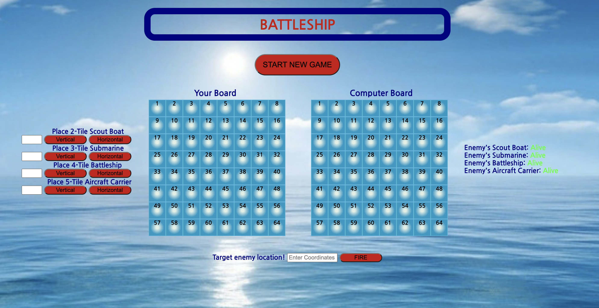

# Battleship

**Live Link:** [play here](https://coriocharles.github.io/BattleShip-Test/)
## Objective
Battleship is a turn-based strategy game which consists of two teams placing pieces on their board and making educated guesses to attack their opponent's board.  The objective of the game is to destroy the enemies ships (pieces) before they destroy yours.

--------------

#### Screenshot:

--------------

## Code Styles
- HTML
- JavaScript
- CSS

--------------

## Playing the Game
To begin, click the "START NEW GAME" button.  You will then be prompted to place your ships, which you can handle on the left side of the page.  Place all 4 ships on valid locations on your board, either vertically or horizontally.  Once your ships are placed, the computer will do the same.  You are now ready to take your first shot at the enemy.  Take turns making strategic artilley strikes until one player's ships are all destroyed, repeat the process.